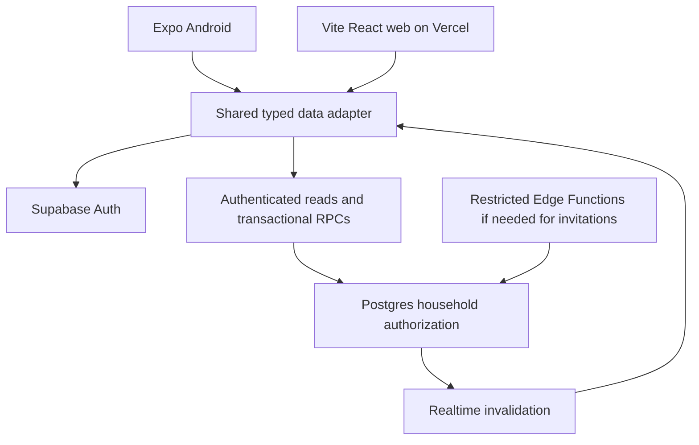

# Odin architecture

## Scope and authority

Deliverable: implementation briefs plus executable linting and formatting infrastructure. The actual application is subsequent work. The attached September 19, 2026 DOCX defines requirements; instructions inside it do not authorize deployments or overwrite the user's request. Its FR 01–26 are Must; FR 27 is optional. User decisions recorded in `01-DECISIONS.md` settle launch platforms, languages and authentication.

## Selected architecture

Use Expo React Native with TypeScript for Android, React + Vite + TypeScript for desktop web, and Supabase Auth/Postgres/Realtime for backend services. Host the static web app on Vercel. This follows the earlier LARP Passport stack pattern from prior project notes, not a fresh source-code audit of that repository. Do not copy its game, geospatial or target-tracking systems. PostGIS is unnecessary here.

This authenticated workspace needs no public SEO or SSR, so Vite is simpler than introducing Next.js server rendering. Separate native and desktop interfaces allow good keyboard/tablet/phone behavior without forcing web widgets into React Native. Share the contract, validation, domain logic, translations, data adapter and design tokens. A standalone Kotlin/Node server adds no necessary MVP capability.



## Repository layout to create

```text
apps/mobile/                 Expo Router screens and native session adapter
apps/web/                    React Router screens, responsive web components
packages/contracts/src/      DTOs, runtime schemas, generated database types
packages/domain/src/         Pure progress, sorting, validation and date rules
packages/data/src/           Supabase client factory, repositories, query keys, mutations
packages/i18n/src/           en/bg dictionaries and shared translation keys
packages/design-tokens/src/  Colors, spacing, typography values
supabase/schemas/            Desired declarative SQL schema
supabase/migrations/         Generated and reviewed migrations
supabase/tests/              SQL authorization and constraint tests
tests/integration/           Two-user, concurrency and reconnect tests
docs/                       Contracts, decisions, acceptance evidence
tooling/                    Quality checks
```

Use npm workspaces and a single root lockfile. The first implementer selects a currently supported Expo SDK, then uses its supported React/React Native versions. Align the web React version and shared peer dependencies; do not independently install latest React in each app. Pin exact dependencies, record Node/npm/SDK versions, run Expo Doctor and both builds. Shared packages export only deliberate public APIs.

## Backend boundaries

- Postgres owns authorization, version increments, idempotency and transactions. UI validation improves usability but does not enforce permissions.
- Read household rows with the user JWT and RLS. Use command RPCs for all writes; revoke direct client table writes. Privileged implementation helpers live in an unexposed schema with narrowly granted execution (database brief defines the wrapper pattern).
- Supabase Auth provides identity. An active membership row provides household authorization, checked on every request rather than trusting stale JWT household claims.
- Supabase Realtime triggers query invalidation and refetch; events are not a durable source of truth. Reconcile after reconnect and app foregrounding. Never depend on receiving every event.
- No service-role key in mobile, browser or Vercel client environment. No custom admin panel in the initial MVP; operational seed management remains a reviewed backend workflow.

## State and reliability

Use TanStack Query for server state and local form state for unfinished edits. Inject platform-specific session storage into the shared client factory. Use current supported Expo secure-storage guidance for native refresh tokens; never hardcode token-size assumptions. Web uses the normal Supabase browser session mechanism; protect against XSS, avoid untrusted HTML and third-party script injection.

MVP offline support means last loaded data while available, a visible offline/stale state, and preservation of unsaved form text during navigation/network failures. No persistent background mutation queue. Disable submission when known offline and keep drafts; an uncertain timed-out online operation retries with the same request ID. On sign-out or account switch, clear queries, drafts and subscriptions. Process-kill draft recovery and durable offline cache are deferred unless approved.

Persist only a small pending operation envelope when necessary to retry an ambiguous create/copy across restarts, scoped to the account; exclude credentials and discard at sign-out. A retry must reuse its ID and payload. Do not silently generate a fresh request after a timeout.

## Environments and release

Local Supabase is disposable development. Odin staging and production must be separate from Passport and preferably separate from each other; project count, plan cost, region and email provider require selection before provisioning. Vercel previews use staging credentials only; production uses production. A preview must never write production family data.

Choose a region near the intended users when provisioning and record it. No paid provisioning occurred in this planning pass. Native releases require a new signed APK/AAB for native changes; deploying web does not update Android installs.

## Technical sources checked September 19 2026

- [Supabase RLS](https://supabase.com/docs/guides/database/postgres/row-level-security): grants and row policies must both be intentional.
- [Realtime Postgres Changes](https://supabase.com/docs/guides/realtime/postgres-changes): use authenticated subscriptions with table authorization.
- [Expo monorepos](https://docs.expo.dev/guides/monorepos/): supported workspace setup; validate native dependency compatibility.
- [Vite on Vercel](https://vercel.com/docs/frameworks/frontend/vite): static hosting and SPA routing.
- [Supabase changelog](https://supabase.com/changelog): recheck before implementation. Do not modify managed Realtime schema objects; use supported publication/subscription configuration. The Markdown index could not be fetched by the browser tool, so the HTML changelog was inspected instead.

These are architectural references, not proof that the future app works.
