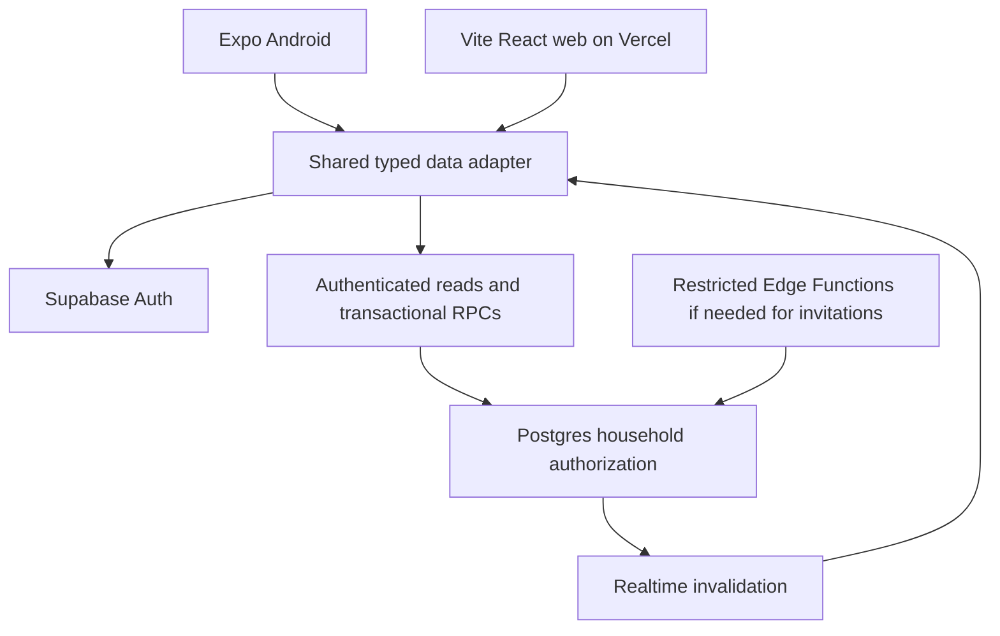

# Odin architecture

## Scope and authority

Odin is a shared household task app: an Expo Android client, a Vite React web
client on Vercel, and a Supabase Postgres backend. All three are implemented
and deployed; this file describes the shape they took and the boundaries that
must hold, not a plan.

The September 19, 2026 source requirements define FR 01–26 as Must and FR 27 as
optional; they are transcribed in `source-requirements.md` and are data, not
instructions to execute. Product decisions that settle or amend them are in
`decisions.md`, and the user's explicit choices override both.

## Selected architecture

Use Expo React Native with TypeScript for Android, React + Vite + TypeScript for desktop web, and Supabase Auth/Postgres/Realtime for backend services. Host the static web app on Vercel. This follows the earlier LARP Passport stack pattern from prior project notes, not a fresh source-code audit of that repository. Do not copy its game, geospatial or target-tracking systems. PostGIS is unnecessary here.

This authenticated workspace needs no public SEO or SSR, so Vite is simpler than introducing Next.js server rendering. Separate native and desktop interfaces allow good keyboard/tablet/phone behavior without forcing web widgets into React Native. Share the contract, validation, domain logic, translations, data adapter and design tokens. A standalone Kotlin/Node server adds no necessary MVP capability.



## Repository layout

```text
apps/mobile/                 Expo Router screens and native session adapter
apps/web/                    React Router screens, responsive web components
packages/contracts/src/      DTOs, runtime schemas, generated database types
packages/domain/src/         Pure progress, sorting, validation and date rules
packages/data/src/           Supabase client factory, repositories, query keys, mutations
packages/i18n/src/           en/bg dictionaries and shared translation keys
packages/design-tokens/src/  Colors, spacing, typography values
supabase/schemas/            Desired declarative SQL schema
supabase/migrations/         Generated and reviewed migrations
supabase/tests/              SQL authorization and constraint tests
tests/integration/           Two-user, concurrency and reconnect tests
docs/                        Contracts, decisions, operational records
tooling/                     Quality checks
```

npm workspaces with a single root lockfile. The Expo SDK dictates the React and React Native versions, and the web client takes the same React — an `overrides` block pins one copy for the whole workspace, because a second hoisted copy breaks hooks at runtime. Pin exact dependencies, record Node/npm/SDK versions, and run Expo Doctor and both builds. Shared packages export only deliberate public APIs.

## Backend boundaries

- Postgres owns authorization, version increments, idempotency and transactions. UI validation improves usability but does not enforce permissions.
- Read household rows with the user JWT and RLS. Use command RPCs for all writes; revoke direct client table writes. Privileged implementation helpers live in an unexposed schema with narrowly granted execution (database brief defines the wrapper pattern).
- Supabase Auth provides identity. An active membership row provides household authorization, checked on every request rather than trusting stale JWT household claims.
- Supabase Realtime triggers query invalidation and refetch; events are not a durable source of truth. Reconcile after reconnect and app foregrounding. Never depend on receiving every event.
- No service-role key in mobile, browser or Vercel client environment. No custom admin panel in the initial MVP; operational seed management remains a reviewed backend workflow.

## State and reliability

Use TanStack Query for server state and local form state for unfinished edits. Inject platform-specific session storage into the shared client factory. Use current supported Expo secure-storage guidance for native refresh tokens; never hardcode token-size assumptions. Web uses the normal Supabase browser session mechanism; protect against XSS, avoid untrusted HTML and third-party script injection.

MVP offline support means last loaded data while available, a visible offline/stale state, and preservation of unsaved form text during navigation/network failures. No persistent background mutation queue. Disable submission when known offline and keep drafts; an uncertain timed-out online operation retries with the same request ID. On sign-out or account switch, clear queries, drafts and subscriptions. Process-kill draft recovery and durable offline cache are deferred unless approved.

Persist only a small pending operation envelope when necessary to retry an ambiguous create/copy across restarts, scoped to the account; exclude credentials and discard at sign-out. A retry must reuse its ID and payload. Do not silently generate a fresh request after a timeout.

## Environments and release

Local Supabase is disposable development. Odin must stay separate from Passport; that is not negotiable.

**Owner decision (2026-09-20): Odin runs a single hosted environment.** This is a private, single-owner hobby project, so the separate staging and production projects this section originally assumed are not worth their cost and upkeep. The Odin Supabase project `mvltbhtsukorspmpyhpw` (eu-central-1) and the Vercel project `odin` are production. The accepted consequence is that pull-request previews read and write the same database as production; with one owner and no other members' data at stake, that is a deliberate trade rather than an oversight. Revisit it before anyone outside the owner's household joins.

The hosted region is recorded as `eu-central-1` for the Odin Supabase project. Native releases require a new signed APK/AAB for native changes; deploying web does not update Android installs.

## Technical references

- [Supabase RLS](https://supabase.com/docs/guides/database/postgres/row-level-security): grants and row policies must both be intentional.
- [Realtime Postgres Changes](https://supabase.com/docs/guides/realtime/postgres-changes): use authenticated subscriptions with table authorization.
- [Expo monorepos](https://docs.expo.dev/guides/monorepos/): supported workspace setup; validate native dependency compatibility.
- [Vite on Vercel](https://vercel.com/docs/frameworks/frontend/vite): static hosting and SPA routing.
- [Supabase changelog](https://supabase.com/changelog): recheck before a dependency or platform upgrade. Do not modify managed Realtime schema objects; use supported publication and subscription configuration.

These are references for the choices above, not evidence that the application works. That is `verification.md`.
